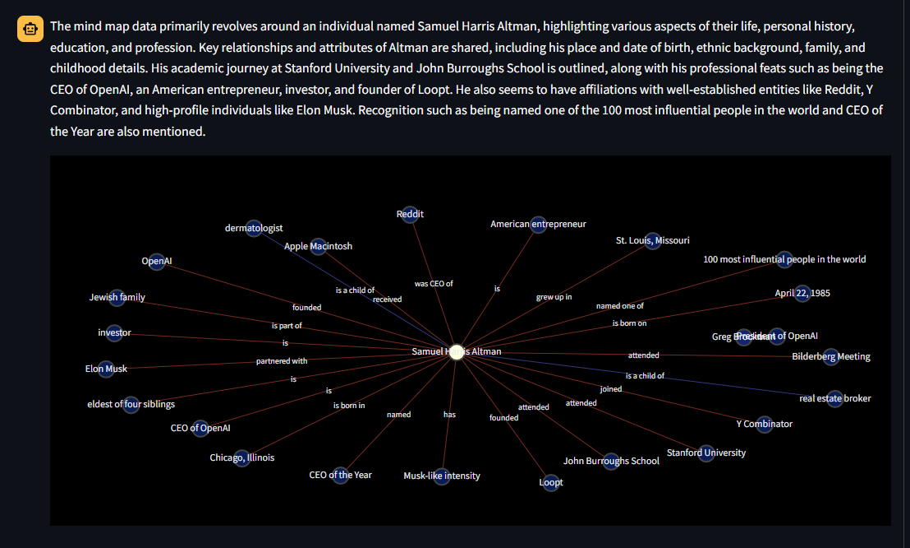

# Mind Mapper

This is a project designed to leverage the RAG pipeline and LLMs to create a network representation of knowledge for better navigation and understanding.

The motivation was to go beyond the “simple” RAG framework, where a user queries a vector database and its response is then fed to an LLM like GPT-4 for an enriched answer.

Mind Mapper leverages RAG to create intermediate result representations useful to perform some kind of *knowledge intelligence* which is allows us in turn to better understand the output results of RAG over long and unstructured documents.

For example, given a keyword or concept as input (like "Sam Altman"), the tool will return a knowledge graph of all entities tied to Sam Altman. You can apply this mechanism to any data source you want by simply adding data through the streamlit interface.

## Features

Here are some of the tool’s features:

- Manages text in basically all forms: copy-paste, textual and originating from audio source (video is contemplated too if the project is well received)
- Uses an in-project SQLite database for data persistence
- Leverages the state-of-the-art Upstash vector database to store vectors efficiently
- Chunks from the vector database are then used to create a knowledge graph of the information
- A final LLM is called to comment on the knowledge graph and extract insights

## Installation

Make sure you have `Poetry` installed on your system. 

In the project's folder, run the command `poetry install`. Once installed, run the frontend by executing the command `streamlit run src/frontend.py`

## References

- Related Medium Article in English: https://medium.com/towards-data-science/beyond-rag-network-analysis-through-llms-for-knowledge-extraction-4d107eb5282d
- Related Article on Diario Di Un Analista.it: https://www.diariodiunanalista.it/posts/gpt-mappe-mentali-rag/